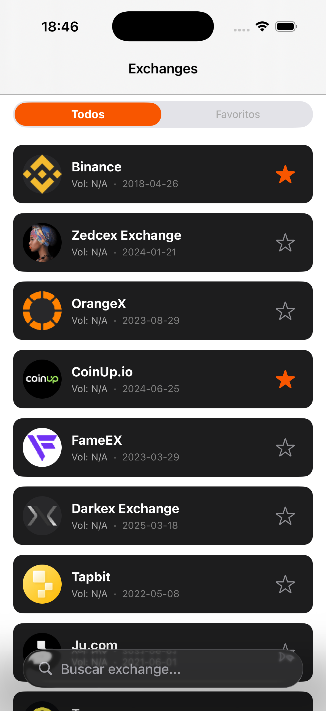
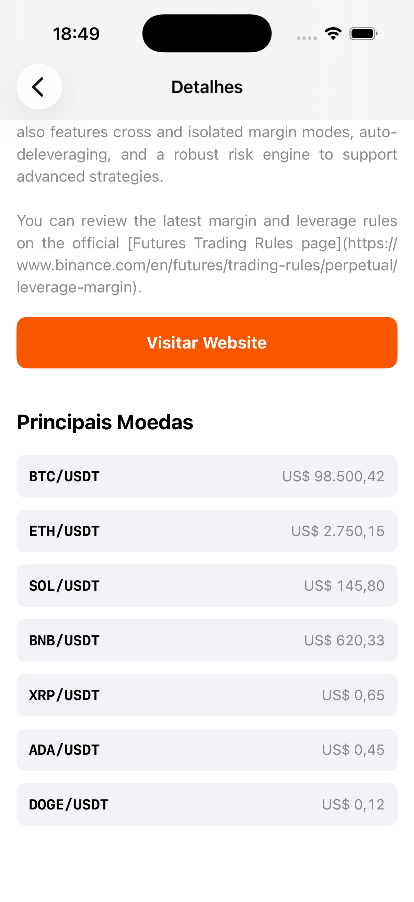

# MB Desafio - iOS

Aplicativo nativo desenvolvido para listar Exchanges de Criptomoedas, exibir detalhes financeiros e gerenciar favoritos, consumindo a API da CoinMarketCap.

---

## 📱 Telas do App

Aqui estão as principais funcionalidades visuais do projeto:

### 1. Listagem e Favoritos
Visualização das exchanges, possui filtro local de favoritos.


### 2. Detalhes da Exchange
Exibição de dados da exchange e listagem de moedas.


### 3. Tratamento de Erro (API Gratuita)
Fallback inteligente: Caso a API retorne erro 403 (limitação do plano Free) na api que tras as moedas do exchange, o app exibe dados mockados para garantir a experiência de UI.


---

## 🚀 Funcionalidades

- **Listagem:** Consulta à API `/map` da CoinMarketCap.
- **Favoritos:** Persistência de dados usando `UserDefaults`.
- **Busca:** Filtragem em tempo real pelo nome da exchange.
- **Resiliência:** Tratamento de erros de rede e degradação.
- **Interface:** Layout construído com ViewCode e suporte a Dark Mode.

## 🛠 Tecnologias e Arquitetura

O projeto segue a arquitetura **MVVM-C (Model-View-ViewModel-Coordinator)** para garantir separação de responsabilidades e testabilidade.

- **Linguagem:** Swift 5
- **UI:** UIKit (ViewCode)
- **Concorrência:** Swift Concurrency (`async/await`, `@MainActor`)
- **Navegação:** Coordinator Pattern

## ⚙️ Como Rodar o Projeto

1. Clone este repositório.
2. Abra o arquivo `Secrets.swift` em `Application/Secrets.swift`.
3. Insira sua chave da API:
   ```swift
   static let coinMarketCapKey = "YOUR_KEY"
